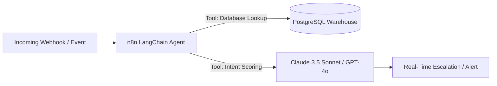

# 🤖 Enterprise n8n Workflow Blueprints & AI Agents

  
  
  
  

 

A curated collection of battle-tested, production-ready **n8n workflow blueprints** integrating LLM reasoning agents, LangChain memory buffers, high-throughput webhooks, and PostgreSQL storage.

---

## 🏗️ Blueprint Catalog

### 1. Lead Triage & Autonomous AI Agent (`workflows/lead_triage_rag_agent.json`)
* Ingests real-time lead payloads, performs semantic scoring via LLM agents, and persists directly into PostgreSQL with structured schemas.

### 2. Incident & Security Quarantine Webhook (`workflows/security_quarantine_webhook.json`)
* Listens to edge alerts from Cloudflare Workers, triggers automated IP quarantines, and sends notification payloads.

---

## 🚀 How to Import

1. In your **n8n instance**, go to **Workflows** -> **Import from File**.
2. Select any `.json` file from the `workflows/` directory.
3. Configure your credential variables via `.env` or n8n Credential Store.

---

## 📄 License
MIT License. See `LICENSE` for details.
