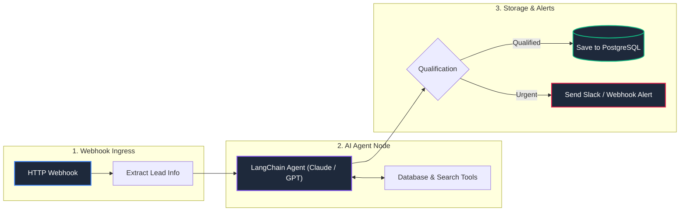

# 🤖 Enterprise n8n Workflow Blueprints & AI Agents

 

**Production-Tested n8n Workflows & AI Agent Blueprints**  
*Modular n8n JSON templates integrating LangChain reasoning nodes, webhook gateways, automated retries, and PostgreSQL database queries.*

---

## 📌 Overview

This repository shares **curated n8n workflow blueprints** that demonstrate how to connect webhooks, AI agents (Claude / GPT-4o), and databases in a maintainable, visual architecture.

---

## 🏗️ Example Architecture: Agentic Lead Routing

---

## 📦 Blueprint Catalog

| Workflow File | Description | Integrations |
| :--- | :--- | :--- |
| **[`lead_triage_rag_agent.json`](workflows/lead_triage_rag_agent.json)** | Evaluates incoming lead payloads with LLM reasoning and saves qualified profiles to PostgreSQL. | n8n, LangChain, Claude, PostgreSQL |
| **[`security_quarantine_webhook.json`](workflows/security_quarantine_webhook.json)** | Receives security alerts from edge workers and logs events for IP quarantine. | n8n Webhook, PostgreSQL, Logic Nodes |

---

## 🚀 How to Import

1. In your **n8n instance**, go to **Workflows**.
2. Click **Add Workflow** ➔ **Import from File**.
3. Choose any `.json` file from the [`workflows/`](workflows/) folder.
4. Add your own database and LLM credentials in n8n's credential manager.

---

## 📄 License
Distributed under the **MIT License**. See `LICENSE` for details.
