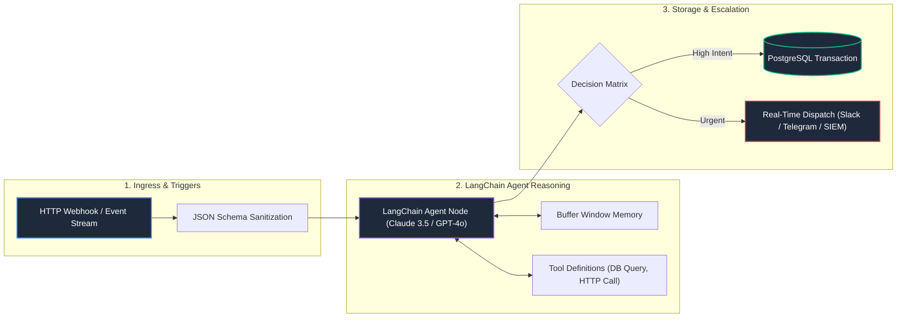

# 🤖 Enterprise n8n Workflow Blueprints & AI Agents

<div align="center">

[](https://n8n.io/)
[](https://docs.n8n.io/integrations/builtin/cluster-nodes/root-nodes/n8n-nodes-langchain.agent/)
[](https://anthropic.com/)
[](https://www.postgresql.org/)
[](LICENSE)

<br>

**Production-Tested Agentic Workflows & Event-Driven Automation Blueprints**  
*Modular n8n JSON templates integrating LangChain reasoning agents, self-healing retries, webhook routing, and enterprise database transactions.*

</div>

---

## 📌 Executive Summary

Building enterprise automations often degrades into fragile, unmaintainable scripts.

This repository provides **battle-tested, production-ready n8n blueprints** implementing modern agentic design patterns: tool calling, structured memory buffers, deterministic routing branches, and database transaction logging.

---

## 🏗️ Architecture: Agentic Workflow Execution



---

## 📦 Blueprint Catalog

| Blueprint | Category | Key Integrations | Description |
| :--- | :--- | :--- | :--- |
| **`lead_triage_rag_agent.json`** | AI Lead Intelligence | LangChain Agent, Claude 3.5 Sonnet, PostgreSQL | Evaluates incoming lead payloads via LLM tools and persists structured intent records. |
| **`security_quarantine_webhook.json`** | Edge Threat Response | Webhooks, Cloudflare Workers, PostgreSQL | Ingests real-time security alerts from edge routers and executes dynamic IP quarantine actions. |

---

## 🚀 How to Import and Deploy

1. In your **n8n instance** (Cloud or Self-Hosted), navigate to **Workflows**.
2. Click **Add Workflow** ➔ **Import from File**.
3. Select the desired `.json` blueprint from the [`workflows/`](workflows/) directory.
4. Set up your environment credentials in the n8n Credential Manager:
   * **Anthropic / OpenAI API Keys**
   * **PostgreSQL Connection String**
5. Activate the workflow and test with sample webhook triggers.

---

## 📂 Repository Structure

```
n8n-agentic-production-blueprints/
├── workflows/
│   ├── lead_triage_rag_agent.json          # AI Lead Triage & Database Insertion Workflow
│   └── security_quarantine_webhook.json    # Edge Security Alert Ingestion Pipeline
├── LICENSE                                 # MIT License
└── README.md                               # Architecture Catalog & Import Guide
```

---

## 📄 License
Distributed under the **MIT License**. See `LICENSE` for details.
